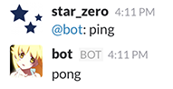
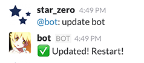
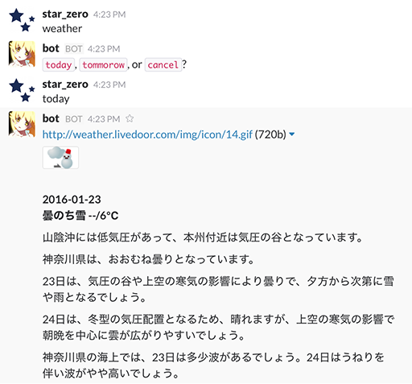
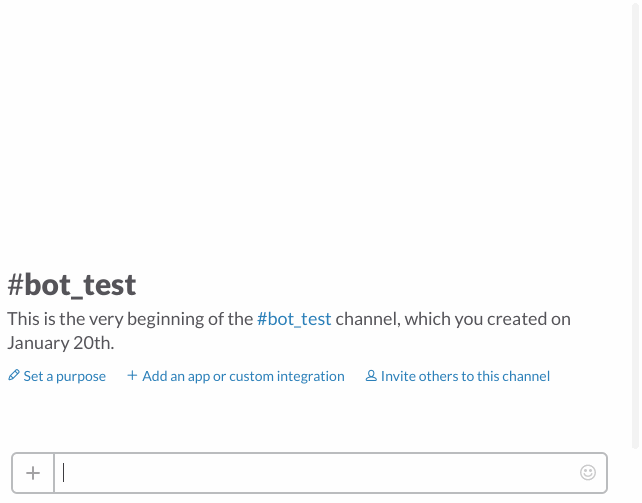

My Bot
===

## Installation

```
$ npm install forever -g
$ npm install
```

## Setup

#### Slack token

Add slack token to system environment variables.

See [botkit getting started](https://github.com/howdyai/botkit#getting-started).

```
export bot_token=xxxxxxxx
```

#### Slack channel

Add channel `info` for job notifications.

#### Tumblr token

Add Tumblr token to system environment variables.

Tumblr token get to [here](https://www.tumblr.com/oauth/apps) and click `Explore API`. Register app if yet not exist.

```
export tumblr_consumer_key=xxxxxxxx
export tumblr_consumer_secret=xxxxxxxx
export tumblr_token=xxxxxxxx
export tumblr_token_secret=xxxxxxxx
```

## Usage

#### Start

```
$ npm start
```

#### Stop

```
$ npm stop
```

## Bot

### ping/pong

```
@bot: ping
```



### Update bot

```
@bot: update bot
```



### Weather forecasts

```
@bot: weather [today|tommorow]
```



### Tumblr dashboard

Show Tumblr dashboard. only photo type, limit 5.

```
@bot: tumblr
```



## Job

* notify weather forecasts to 7:00
* notify trash collection schedule to 0:00
